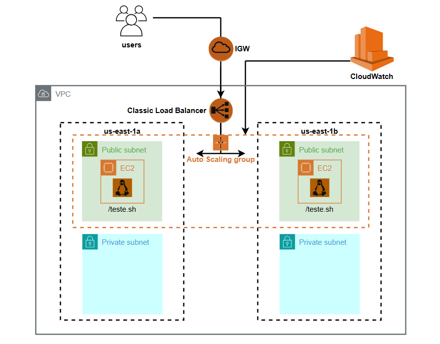

# Projeto AWS - Auto Scaling Group + Classic Load Balancer | PB Compass UOL – ABR 2025

## 📝 Descrição do Projeto

Projeto desenvolvido em dupla como parte da Trilha AWS no Programa de Bolsas Compass UOL - Abril 2025 | AWS & DevSecOps.

O objetivo deste projeto foi implementar uma solução de **escalonamento automático** na AWS, utilizando **Auto Scaling Group (ASG)**, **Classic Load Balancer (CLB)** e um **endpoint HTTP** simples para teste de escalonamento com geração de carga.

## ⚙️ Arquitetura do Projeto

A imagem abaixo representa a arquitetura principal da solução implementada na AWS:

**A arquitetura contempla:**

- **Uma VPC personalizada**, contendo:

  - **2 subnets públicas** (em us-east-1a e us-east-1b)

  - **2 subnets privadas** (em us-east-1a e us-east-1b)

- **Internet Gateway (IGW)** associado às subnets públicas.

- **Classic Load Balancer (CLB)** recebendo o tráfego externo e distribuindo para as instâncias EC2 nas subnets públicas.

- **Auto Scaling Group (ASG)** responsável por criar e gerenciar as instâncias EC2 nas subnets públicas.

- **Instâncias EC2 com Amazon Linux 2**, configuradas com Apache e o endpoint de teste.

- **Amazon CloudWatch**, monitorando as métricas das instâncias EC2 e acionando as políticas de escalonamento do ASG.

## 🛠️ Tecnologias Utilizadas

## 🔽 Etapas do Projeto

>O projeto foi dividido em **9 etapas sequenciais**, sendo fundamental que o usuário siga **exatamente na ordem**, começando pela **Etapa 01** e prosseguindo até a **Etapa 09**, para garantir o funcionamento correto de toda a infraestrutura.

>Cada etapa possui um README específico com o **passo a passo detalhado**, os **prints de cada configuração** e as **instruções necessárias**.

>👉 **Clique no link de cada etapa abaixo para acessar o seu respectivo README:**

### ➤ Etapa 01 – Criação da VPC

Nesta etapa foi criada uma VPC personalizada com 2 subnets públicas, 2 subnets privadas, internet gateway e tabelas de rotas.

**[🔗 ACESSE O PASSO A PASSO COMPLETO DA ETAPA 01](etapa-01-criacao-vpc.md)**  

### ➤ Etapa 02 – Grupo de Segurança (Security Group)

Configuração de um grupo de segurança permitindo acesso via HTTP (porta 80) e SSH (porta 22).

**[🔗 ACESSE O PASSO A PASSO COMPLETO DA ETAPA 02](etapa-02-grupo-seguranca.md)**  

### ➤ Etapa 03 – Instância EC2 e Configuração do User Data

Lançamento da EC2 com Amazon Linux 2, configuração de Apache HTTP Server e o endpoint de teste via User Data.

**[🔗 ACESSE O PASSO A PASSO COMPLETO DA ETAPA 03](etapa-03-ec2-userdata.md)**  

### ➤ Etapa 04 – Criação da AMI

Geração de uma AMI a partir da instância EC2 configurada.

**[🔗 ACESSE O PASSO A PASSO COMPLETO DA ETAPA 04](etapa-04-criacao-ami.md)**  

### ➤ Etapa 05 – Criação do Launch Template

Criação de um Launch Template utilizando a AMI criada, definindo tipo de instância e User Data.

**[🔗 ACESSE O PASSO A PASSO COMPLETO DA ETAPA 05](etapa-05-launch-template.md)**  

### ➤ Etapa 06 – Configuração do Classic Load Balancer (CLB)

Criação de um Classic Load Balancer, configuração de listeners e associação com o grupo de segurança.

**[🔗 ACESSE O PASSO A PASSO COMPLETO DA ETAPA 06](etapa-06-clb.md)**  

### ➤ Etapa 07 – Criação do Auto Scaling Group (ASG)

Criação do ASG com as políticas de mínimo, máximo e desejado, além da associação com o CLB e subnets.

**[🔗 ACESSE O PASSO A PASSO COMPLETO DA ETAPA 07](etapa-07-asg.md)**  

### ➤ Etapa 08 – Configuração dos CloudWatch Alarms

Criação de dois alarmes: um para scale out e outro para scale in, com métricas ajustadas conforme a carga.

**[🔗 ACESSE O PASSO A PASSO COMPLETO DA ETAPA 08](etapa-08-cloudwatch-alarms.md)**  

### ➤ Etapa 09 – Teste de Escalonamento Automático

Teste de carga utilizando a ferramenta `hey` para validar o Auto Scaling Group.

**[🔗 ACESSE O PASSO A PASSO COMPLETO DA ETAPA 09](etapa-09-teste-escalonamento.md)**  

## 👩‍💻 Desenvolvido por:

<table>
  <tr>
    <td align="center"><a href="https://github.com/JuhLima89"> <b>Juliana Lima</b></a> </td>

  <td align="center"><a href="https://github.com/MarcelaLinhares"> <b>Marcela Linhares</b></a> </td>