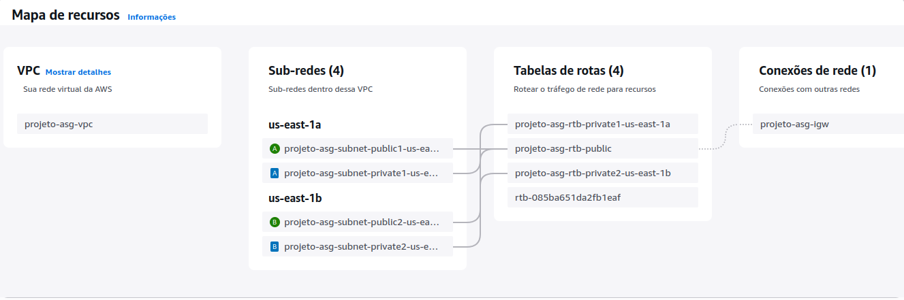

# Etapa 01 – Criar a Rede (VPC, Subnets, IGW e Tabelas de Rotas)

Nesta etapa foi criada a infraestrutura de rede do Projeto AWS Auto Scaling Group, com base nas boas práticas de arquitetura em nuvem.

A configuração foi realizada manualmente através do Console da AWS, garantindo separação entre subnets públicas e privadas, além de distribuição dos recursos entre duas zonas de disponibilidade (us-east-1a e us-east-1b).

---

## 1.1 – Criação da VPC

>Acesse o console da AWS > **VPC > Suas VPCs > Criar VPC**

Foi criada uma **VPC personalizada** com o seguinte bloco CIDR:

- **Nome da VPC:** `projeto-asg-vpc`
- **CIDR:** `10.0.0.0/16`

Essa VPC servirá como a base para todos os recursos que serão criados nas próximas etapas.

## 1.2 – Criação das Subnets

Foram criadas **quatro subnets**, sendo:

- **2 Subnets Públicas:**  
  - `Public-Subnet-1-us-east-1a` → Zona: us-east-1a  
  - `Public-Subnet-2-us-east-1b` → Zona: us-east-1b 

- **2 Subnets Privadas:**  
  - `Private-Subnet-1-us-east-1a` → Zona: us-east-1a 
  - `Private-Subnet-2-us-east-1b` → Zona: us-east-1b 

Essa separação permite um melhor controle de acesso e segurança na infraestrutura.

## 1.3 – Criação do Internet Gateway (IGW)

Para permitir que as subnets públicas tenham acesso à internet, foi criado um **Internet Gateway (IGW)** com as seguintes configurações:

- **Nome do IGW:** `projeto-asg-igw`
- **Estado:** ✅ Ativo
- **Associação:** Conectado à VPC criada anteriormente

---

## 1.4 – Configuração das Tabelas de Rotas

Para garantir o roteamento correto entre os recursos da VPC e a internet, foram criadas **três tabelas de rotas**, sendo:

- **1 Tabela de Rota Pública**, com destino `0.0.0.0/0` apontando para o IGW.
- **2 Tabelas de Rotas Privadas**, associadas a cada subnet privada (sem rota para internet).

---

## 1.5 – Mapa de Recursos da VPC

Após a criação de todos os recursos acima, foi gerado o **Mapa de Recursos da VPC**, mostrando visualmente a estrutura criada.

 

---

## ✅ Conclusão da Etapa

A infraestrutura de rede está pronta para os próximos passos do projeto, como a criação de instâncias EC2, load balancer e grupo de auto scaling.

---

### **[🔙 Voltar - README Principal](README.md) | [➡️ Avançar - Etapa 02](etapa-02-grupo-seguranca.md)**