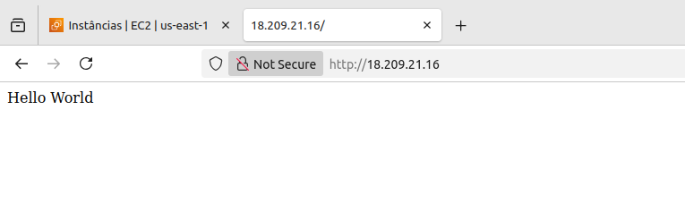

# Etapa 03 – Criar Instância EC2 e Configurar o User Data

Nesta etapa foi criada uma **instância EC2** com **Amazon Linux 2**, além da configuração de um script **User Data** para instalação do Apache HTTP Server e criação de uma página de teste.

A configuração foi feita manualmente pelo Console da AWS, seguindo as boas práticas para ambientes de laboratório.

---

## 1. Lançamento da Instância EC2

>Acesse o Console da AWS > **EC2 > Instâncias > Executar Instâncias**

Foram utilizadas as seguintes configurações:

- **AMI:** Amazon Linux 2, SSD Volume Type
- **Tipo de instância:** t2.micro (Free Tier)
- **Par de chaves:** Utilizamos o par de chaves já existente
- **VPC:** `projeto-asg-vpc`
- **Subnet:** Uma das **subnets públicas** criadas na etapa anterior
- **Grupo de segurança:** `projeto-asg-sg` (permitindo acesso HTTP e SSH)

## 2. Configuração do User Data

Durante o lançamento da instância, foi inserido o seguinte **User Data**, com o objetivo de:

- Instalar o Apache HTTP Server

- Criar uma página HTML de teste

- Configurar um script CGI (`/teste.sh`) para simulação de carga

- Habilitar a execução de scripts CGI no Apache

```bash
#!/bin/bash

# Atualiza o sistema
yum update -y

# Instala o Apache
yum install -y httpd

# Cria a página principal
echo "Hello World" > /var/www/html/index.html

# Cria o script CGI que simula carga
cat <<EOL > /var/www/html/teste.sh
#!/bin/bash
echo "Content-type: text/plain"
echo ""
echo "Requisição recebida em \$(hostname)"
sleep 5
EOL

# Dá permissão de execução
chmod +x /var/www/html/teste.sh

# Habilita execução de CGI no Apache
echo '
<Directory "/var/www/html">
    Options +ExecCGI
    AddHandler cgi-script .cgi .pl .sh
</Directory>
' > /etc/httpd/conf.d/enable-cgi.conf

# Inicia e habilita Apache no boot
systemctl start httpd
systemctl enable httpd
```
> Este script garante que a instância estará pronta para atender requisições HTTP, incluindo o endpoint `/teste.sh` para simulação de carga.

## 3. Tags de Recurso

As **tags obrigatórias** foram adicionadas conforme solicitado no projeto.

> 🔐 **Importante:** Por motivos de segurança, **os valores reais das tags não estão sendo exibidos nesta documentação**.

## 4. Verificação da Instância e Acesso ao Endpoint HTTP

Após o lançamento da instância, foram realizadas as seguintes validações:

- **Status da instância:** ✅ Running (em execução)


- **Verificação via navegador:** Acessamos o **IP público da instância** e confirmamos a página de teste com a seguinte mensagem: `Hello World`




## ✅ Conclusão da Etapa

A **instância EC2** está criada e configurada, com o **Apache em execução** e o **endpoint de teste disponível**.

Essa instância será usada na próxima etapa para criar a **AMI** que servirá de base para o **Auto Scaling Group**.

---

### **[🔙 Voltar - Etapa 02](etapa-02-grupo-seguranca.md) | [➡️ Avançar - Etapa 04](etapa-04-criacao-ami.md)**
