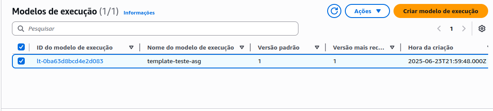

# Etapa 05 – Criação do Launch Template

Nesta etapa foi criado um **Launch Template (Modelo de Execução)** que será utilizado pelo **Auto Scaling Group (ASG)** nas próximas etapas.

O Launch Template define a **AMI**, **tipo de instância**, **grupo de segurança** e outras configurações que serão aplicadas automaticamente a todas as instâncias lançadas pelo ASG.

---

## 1. Criação do Launch Template

>Acesse o Console da AWS > **EC2 > Modelos de Execução > Criar modelo de Execução**

As seguintes configurações foram aplicadas:

- **Nome do modelo:** `template-teste-asg`
- **Descrição:** Launch Template para o Auto Scaling Group – Projeto ASG
- **AMI:** `projeto-asg-ami` (criada na Etapa 04)
- **Tipo de instância:** `t2.micro` (Free Tier)
- **Par de chaves:** Selecionamos o mesmo par de chaves utilizado anteriormente
- **Grupos de segurança:** `projeto-asg-sg` (configurado na Etapa 02)

## 2. Configuração do User Data

Nesta etapa, não foi inserido **User Data** no Launch Template.

>Isso porque a AMI utilizada já foi criada com todo o ambiente configurado, incluindo Apache e o endpoint `/teste.sh`.

## 3. Tags de Recurso

As **tags obrigatórias** foram adicionadas conforme solicitado no projeto.

> 🔐 **Importante:** Por motivos de segurança, **os valores reais das tags não estão sendo exibidos nesta documentação**.

## ✅ Conclusão da Etapa

O **Launch Template** foi criado com sucesso e será utilizado na próxima etapa durante a configuração do **Auto Scaling Group (ASG)**.

---

### **[🔙 Voltar - Etapa 04](etapa-04-criacao-ami.md) | [➡️ Avançar - Etapa 06](etapa-06-auto-scaling-group.md)**