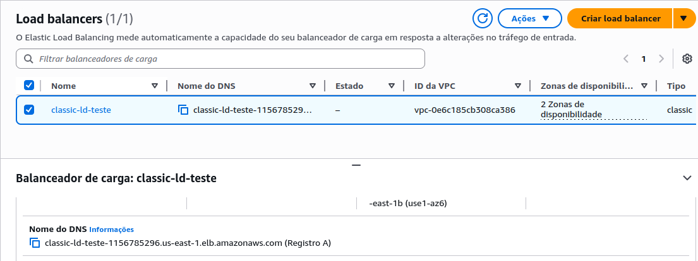
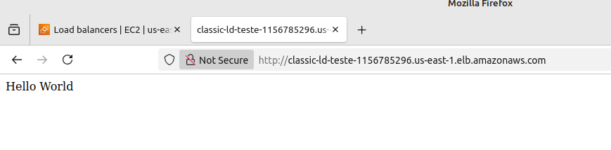

# Etapa 06 – Configuração do Classic Load Balancer (CLB)

Nesta etapa foi criado um **Classic Load Balancer (CLB)**, responsável por distribuir o tráfego HTTP entre as instâncias EC2 em **duas zonas de disponibilidade (AZs)** dentro das **subnets públicas** da VPC.

A configuração foi feita manualmente pelo Console da AWS.

---

## 1. Criação do Classic Load Balancer

>Acesse o Console da AWS > **EC2 > Load Balancers > Criar Load Balancer > Classic Load Balancer**

As seguintes configurações foram aplicadas:

- **Nome do Load Balancer:** `classic-ld-teste`
- **VPC:** `projeto-asg-vpc`
- **Zonas de disponibilidade (AZs):**  
Selecionadas as **duas subnets públicas**, nas zonas:  
  - `us-east-1a`  
  - `us-east-1b`

- **Grupo de segurança:**  
Selecionado o **grupo de segurança `projeto-asg-sg`**, configurado anteriormente na **Etapa 02**, com permissão para **HTTP (porta 80)** e **SSH (porta 22)**.

## 2. Configuração dos Listeners

Foi configurado um **listener padrão HTTP**, com as seguintes definições:

| Protocolo | Porta de Escuta | Protocolo de Instância | Porta de Instância |
|---------- |---------------- |----------------------- |------------------- |
| HTTP      | 80              | HTTP                   | 80                 |

## 3. Configuração de Health Check (Verificação de Saúde)

O **Health Check** foi configurado para verificar a saúde das instâncias EC2 através da porta HTTP, utilizando o caminho `/teste.sh`, que corresponde à página principal criada via **User Data** na instância da **Etapa 03**.

**Configurações aplicadas:**

- **Ping Protocol:** HTTP  
- **Ping Port:** 80  
- **Ping Path:** `/teste.sh`

### Parâmetros do Health Check:

| Parâmetro            | Valor            |
|--------------------- |------------------|
| Intervalo            | 30 segundos      |
| Timeout              | 5 segundos       |
| Unhealthy Threshold  | 2 falhas seguidas |
| Healthy Threshold    | 2 sucessos seguidos |

## ✅ Conclusão da Etapa

O **Classic Load Balancer (CLB)** foi criado com sucesso, distribuindo o tráfego nas **duas zonas públicas da VPC**.

Essa configuração permitirá, nas próximas etapas, a criação do **Auto Scaling Group (ASG)** com balanceamento de carga entre múltiplas instâncias.

---

### **[🔙 Voltar - Etapa 05](etapa-05-launch-template.md) | [➡️ Avançar - Etapa 07](etapa-07-asg.md)**