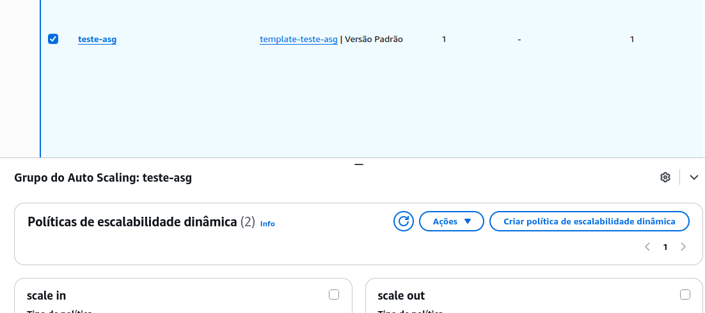

# Etapa 07 – Criação do Auto Scaling Group (ASG)

Nesta etapa foi criado um **Auto Scaling Group (ASG)** responsável por escalar automaticamente as instâncias EC2 com base na demanda.

O ASG foi associado ao **Launch Template**, ao **Classic Load Balancer (CLB)** e às **duas subnets públicas da VPC**.

---

## 1. Criação do Auto Scaling Group

>Acesse o Console da AWS > **EC2 > Auto Scaling > Auto Scaling Groups > Criar Auto Scaling Group**

**Configurações aplicadas:**

- **Nome do grupo:** `teste-asg`
- **Launch Template:** `template-teste-asg` (criado na Etapa 05)
- **Rede:** `projeto-asg-vpc`
- **Subnets:**  
  - `us-east-1a` (subnet pública)  
  - `us-east-1b` (subnet pública)
- **Balanceador de Carga:**  
  - Tipo: Classic Load Balancer  
  - Nome: `classic-ld-teste` (criado na Etapa 06)

- **Políticas de Capacidade:**
  - **Capacidade mínima:** 01
  - **Capacidade desejada:** 01
  - **Capacidade máxima:** 03

## ✅ Conclusão da Etapa

O **Auto Scaling Group (ASG)** foi criado com sucesso, com políticas de capacidade mínima, desejada e máxima.

A associação com o **Launch Template** e o **CLB** garante que o ambiente possa se adaptar automaticamente à demanda, com novas instâncias sendo criadas conforme a necessidade.

---

### **[🔙 Voltar - Etapa 06](etapa-06-clb.md) | [➡️ Avançar - Etapa 08](etapa-08-cloudwatch-alarms.md)**