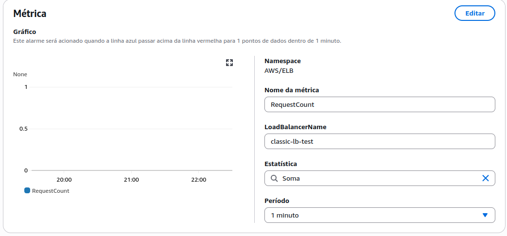
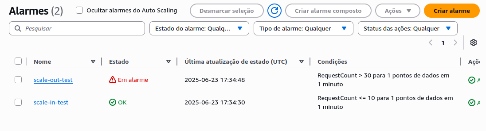
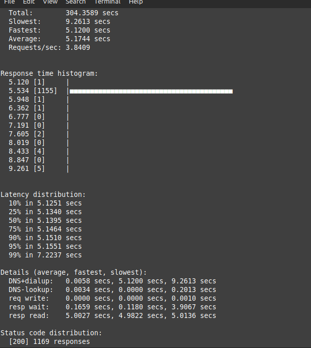

# Etapa 08 – Configuração dos CloudWatch Alarms

Nesta etapa foram criados dois alarmes no **Amazon CloudWatch** para monitorar a carga do **Classic Load Balancer (CLB)** e acionar automaticamente as ações de **Auto Scaling**.

Foram configurados os seguintes alarmes:

- **Alarme de scale out** – adiciona 1 instância quando a carga ultrapassa o limite superior.
- **Alarme de scale in** – remove 1 instância quando a carga diminui abaixo do limite inferior.

---

## 1. Acesso ao CloudWatch e Métrica

>Acesse o Console da AWS > **CloudWatch > Alarmes > Criar alarme**

Na tela de seleção de métricas:

- **Namespace:** `AWS/ELB`
- **Métrica:** `RequestCount`
- **LoadBalancerName:** `classic-lb-test`
- **Estatística:** `Soma`
- **Período:** `1 minuto`



## 2. Criação dos Alarmes

As configurações aplicadas foram:

### 🔺 Alarme de Scale Out

- **Nome:** `scale-out-test`
- **Condição:** `RequestCount > 30` por 1 período de 1 minuto
- **Ação:** **Adicionar** 1 instância no ASG

### 🔻 Alarme de Scale In

- **Nome:** `scale-in-test`
- **Condição:** `RequestCount < 10` por 1 período de 1 minuto
- **Ação:** **Remover** 1 instância do ASG

> ⚠️ Obs.: O valor padrão de teste era `> 10` e `< 5`, mas não gerou ações. Os valores foram ajustados para `> 30` e `< 10` para funcionar corretamente.



## 3. Validação da Configuração

Com os alarmes ativos, a variação da carga sobre o CLB será capaz de disparar automaticamente o escalonamento das instâncias no ASG.



## 4. Ativação das Métricas com `curl`

Para garantir que o **Load Balancer** começasse a registrar requisições e aparecesse nas métricas do **CloudWatch**, foi executado o seguinte comando:

```bash
curl http://classic-lb-teste-1156785296.us-east-1.elb.amazonaws.com/teste.sh
```

>Esse comando simula uma requisição HTTP ao endpoint criado, ativando a métrica `RequestCount` no CloudWatch.

## ✅ Conclusão da Etapa

Os **CloudWatch Alarms** foram configurados com sucesso, habilitando o **Auto Scaling Group** para escalar automaticamente com base no volume de requisições ao CLB.

Isso garante que o ambiente responda dinamicamente ao aumento ou queda na carga, mantendo o desempenho da aplicação.

---

### **[🔙 Voltar - Etapa 07](etapa-07-asg.md) | [➡️ Avançar - Etapa 09](etapa-09-teste-escalonamento.md)**