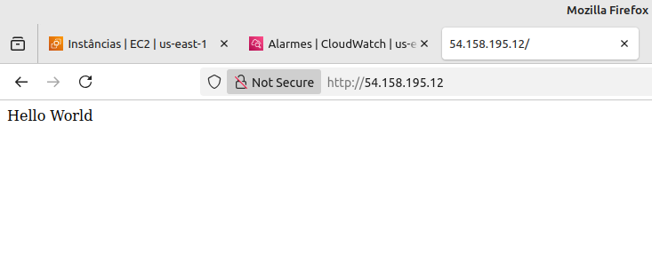
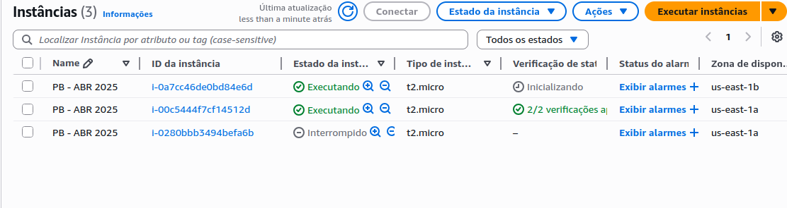
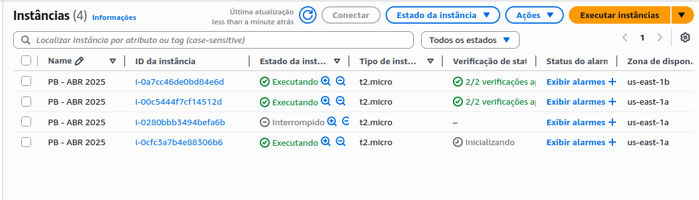
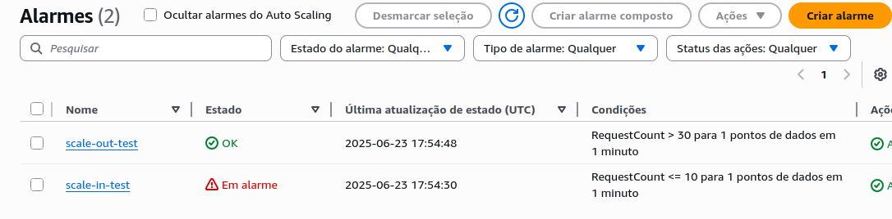
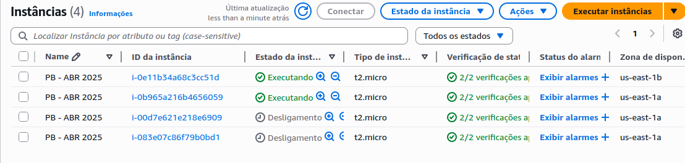

# Etapa 09 – Teste de Escalonamento Automático

Nesta etapa foi realizado um **teste de carga** utilizando a ferramenta `hey` para simular múltiplas requisições ao **Load Balancer**, com o objetivo de validar o comportamento do **Auto Scaling Group (ASG)**.

---

## 1. Geração de carga com `hey`

Para simular tráfego e disparar o Auto Scaling, foi utilizado o comando:

```bash
hey -z 5m -c 20 http://classic-lb-teste-1156785296.us-east-1.elb.amazonaws.com/teste.sh
```

**Parâmetros utilizados:**

- `-z 5m`: duração do teste por 5 minutos

- `-c 20`: 20 conexões simultâneas

>A ferramenta envia requisições contínuas ao endpoint `/teste.sh`, que possui um `sleep 5` no script CGI. Isso simula carga e ativa os alarmes de scale out configurados anteriormente.

## 2. Instância criada automaticamente

Durante o teste de carga, uma nova instância EC2 foi criada automaticamente pelo Auto Scaling, comprovando o funcionamento da política de scale out.



## 3. Visualização das instâncias EC2

Durante o processo de escalonamento, foi possível visualizar o estado das instâncias em execução:

- Inicialmente, uma instância foi iniciada.

- Com o aumento de carga, uma segunda foi provisionada.

- Após o fim do teste, o scale in foi acionado, interrompendo as instâncias excedentes.

>**Estado durante o teste**



>**Estado logo após o fim do teste**



## 4. Estado final dos alarmes
Após o término do teste e estabilização da carga, os alarmes alteraram seus estados conforme esperado:

- scale-out-test: `OK`

- scale-in-test: `Em alarme`



>Alarme de scale out OK e scale in acionado, indicando redução no número de instâncias.

## 5. Estado final das instâncias

Com a ação do scale in, as instâncias excedentes foram finalizadas, e apenas as necessárias permaneceram ativas.



>Situação final após escalonamento automático completo.

## ✅ Conclusão da Etapa

O teste com a ferramenta `hey` validou com sucesso o funcionamento do Auto Scaling Group, com instâncias sendo provisionadas e removidas automaticamente de acordo com a carga.

---

### **[🔙 Voltar - Etapa 08](etapa-08-cloudwatch-alarms.md) | [🚀 Concluir Projeto - Retornar ao README Principal](https://github.com/MarcelaLinhares/Projeto-AWS-ASG_Compass-UOL)**